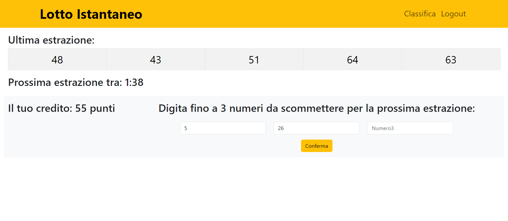
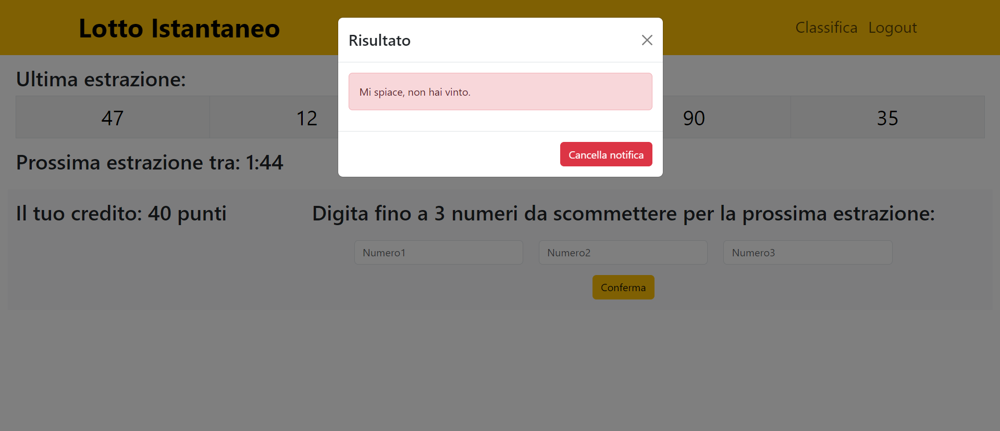

[](https://classroom.github.com/a/HF0PzDJs)
# Exam #3: "Lotto Istantaneo"
## Student: s331059 FENECH SIMONE 

## React Client Application Routes

- Route `/`: home page del sito che mostra l'estrazione corrente e il form per una nuova scommessa.
- Route `/classifica`: contiene una tabella che mostra i primi 3 utenti con più punti.
- Route `/login`: pagina di login contenente le regole del gioco.
- Route `/*`: pagina 404 not found.

## API Server

- GET `/api/classifica`
  - request parameters: _None_
  - request body: _None_
  - response body content: Restituisce i primi 3 giocatori con i loro punti.

  ``` JSON
  [
  {
    "username": "utente1",
    "punti": 150
  },
  {
    "username": "utente2",
    "punti": 140
  },
  {
    "username": "utente3",
    "punti": 130
  }
  ]
  ```

  - response status: `200 OK` (success), `500 Internal Server Error` (generic error), `401 Unauthorized User` (user is not logged in)
- GET `/api/estrazioneCorrente`
    - request parameters: _None_
    - request body: _None_
    - response body content: Restituisce i numeri dell'ultima estrazione.

  ``` JSON
  {
  "id": 10,
  "numero1": 5,
  "numero2": 18,
  "numero3": 22,
  "numero4": 35,
  "numero5": 41,
  "tempoRimanente": 100
  }
  ```

  - response status: `200 OK` (success), `500 Internal Server Error` (generic error), `401 Unauthorized User` (user is not logged in)

- POST `/api/puntate`
  - request parameters: _None_
  - request body: 
  ``` JSON
  {
    "idUser": 1,
    "puntata1": 13,
    "puntata2": 1,
    "puntata3": 60
  }
  ```
  - response body content: Conferma l'inserimento della puntata.

  - response status: `201 Created` (success), `500 Internal Server Error` (generic error), `400 Bad Request` (invalid request)
- GET `/api/controlloPuntata/:idEstrazione/:idUtente` 
  - request parameters: idEstrazione, idUtente
  - request body: _None_
  - response body content: Restituisce un valore booleano: true se l'utente ha giocato, altrimenti false.

  ``` JSON
  {
    "giocato": true
  }
  ```
  - response status: `200 OK` (success), `500 Internal Server Error` (generic error), `401 Unauthorized User` (user is not logged in), `422 Unprocessable Entity` (validation error).

- GET `/api/utenti/:idUtente/punti`
  - request parameters: idUtente
  - request body: _None_
  - response body content: Restituisce il numero di punti disponibili per l'utente.

  ``` JSON
  {
    "username": "username",
    "punti": 150
  }
  ```
  - response status: `200 OK` (success), `500 Internal Server Error` (generic error), `401 Unauthorized User` (user is not logged in), `422 Unprocessable Entity` (validation error).
- GET `/api/notificaVincita/:idUtente`
  - request parameters: idUtente
  - request body: _None_
  - response body content: Restituisce il numero di punti vinti dall'utente durante l'ultima puntata.

  ``` JSON
  {
    "puntiVinti": 10
  }
  ```
  - response status: `200 OK` (success), `500 Internal Server Error` (generic error), `401 Unauthorized User` (user is not logged in), `422 Unprocessable Entity` (validation error).
- PUT `/api/notificaLetta`
  - request parameters: _None_
  - request body: 
  ``` JSON
  {
    "idUtente": 1
  }
  ```
  - response body content: _None_

  - response status: `200 OK` (success), `500 Internal Server Error` (generic error), `401 Unauthorized User` (user is not logged in),
  - GET `/api/sessions/current`
  - request parameters: credenziali per l'autenticazione con password
  - request body: _None_
  - response body content: Restituisce le informazioni dell'utente loggato.

  ``` JSON
  {
    "id": 1,
    "username": "username"
  }
  ```

  - response status: `200 OK` (success), `500 Internal Server Error` (generic error), `401 Unauthorized User` (user is not logged in)
- POST `/api/sessions`
  - request parameters: _None_
  - request body: 
  ``` JSON
  {
    "username": "username",
    "password": "password"
  }
  ```
  - response body content: Restituisce le informazioni dell'utente loggato.

  ``` JSON
  {
    "id": 1,
    "username": "username"
  }
  ```

  - response status: `200 OK` (success), `500 Internal Server Error` (generic error), `401 Unauthorized User` (user is not logged in)
- DELETE `/api/sessions/current`
  - request parameters: credenziali per l'autenticazione con password
  - request body: _None_
  - response body content: _None_
  - response status: `200 OK` (success), `500 Internal Server Error` (generic error), `401 Unauthorized User` (user is not logged in)

## Database Tables

- Tabella `estrazioni` - contiene id, numero1, numero2, numero3, numero4, numero5.
  - _Descrizione_: contiene tutte le estrazioni effettuate.
  - _id_ è la chiave primaria della tabella, un intero che si incrementa automaticamente e identifica univocamente ogni estrazione.
  - _numero1, numero2, numero3, numero4, numero5_ sono cinque campi obbligatori, ognuno dei quali rappresenta un numero estratto. Questi numeri devono essere compresi tra 1 e 90.
- Tabella `utenti` - contiene id, username, password, salt, punti.
  - _Descrizione_: contiene tutti gli utenti registrati.
  - _id_ è la chiave primaria della tabella, un intero che si incrementa automaticamente e identifica univocamente ogni utente.
  - _username_ è un campo obbligatorio e deve essere unico, quindi non possono esserci due utenti con lo stesso username.
  - _password_ è un altro campo obbligatorio che contiene la password criptata, creata usando il sito web https://www.browserling.com/tools/scrypt
  - _salt_ è un altro campo obbligatorio che contiene un valore per rafforare la password e permettere password duplicate. L'ho generato con https://www.browserling.com/tools/random-hex
  - _punti_ è un intero che memorizza i punti dell'utente. Il valore predefinito è 100, quindi ogni nuovo utente inizia con 100 punti.
- Tabella `puntate` -     contiene idUtente, idEstrazione, totalePuntate, puntiVinti, puntata1, puntata2, puntata3, notifica.
  - _Descrizione_: contiene tutte le puntate effettuate dagli utenti.
  - _idUtente_ è un intero obbligatorio che rappresenta l'ID dell'utente che ha effettuato la puntata. È una chiave esterna che fa riferimento alla colonna id della tabella utenti.
  - _idEstrazion_ è un intero obbligatorio che rappresenta l'ID dell'estrazione associata alla puntata. Insieme a idUtente, forma la chiave primaria della tabella, assicurando che un utente non possa effettuare più di una puntata per la stessa estrazione.
  - _totalePuntate_ è un intero obbligatorio che rappresenta l'ammontare complessivo della puntata. Il valore deve essere uno tra 5, 10 o 15.
  - _puntiVinti_ è un intero che indica i punti vinti dall'utente per quella puntata. Il valore predefinito è null, poiché verrà aggiornato solo dopo che verrà effettuata l'estrazione.
  - _puntata1_ è un intero obbligatorio che rappresenta il primo numero giocato dall'utente nella puntata. Deve essere compreso tra 1 e 90.
  - _puntata2_: è un intero opzionale che rappresenta il secondo numero giocato dall'utente. Il valore predefinito è null. Se presente, deve essere compreso tra 1 e 90.
  - _puntata3_: è un intero opzionale che rappresenta il terzo numero giocato dall'utente. Il valore predefinito è null. Se presente, deve essere compreso tra 1 e 90.
  - _notifica_ è un intero che viene utilizzato come flag per stabilire se l'utente ha ricevuto la notifica di vincita o meno. Ha un valore predefinito di 0 (ovvero notifica non letta), che diventa 1 se l'utente legge la notifica.

## Main React Components

- `TabellaClassifica` (in `TabellaClassifica.jsx`): Componente che visualizza la classifica dei migliori tre giocatori. Genera una tabella con le colonne "Posizione", "Username" e "Punti", e mappa i dati recuperati in righe della tabella.
- `NavHeader` (in `NavHeader.jsx`): Componente per la barra di navigazione principale del sito. Visualizza il logo "Lotto Istantaneo" e, se l'utente è autenticato, mostra anche un link alla pagina della classifica e un pulsante di logout. Se l'utente non è autenticato, viene visualizzato un link per il login.
- `LoginForm` (in `FormAutenticazione.jsx`): Componente che contiene un form per permettere agli utenti di autenticarsi. Vengono inoltre mostrate le regole del gioco.
- `EstrazioneLayout` (in `EstrazioneLayout.jsx`): Componente principale per visualizzare la pagina dell'estrazione, i punti dell'utente ed il form per giocare.
- `Estrazione` (in `Estrazione.jsx`): Componente che visualizza l'ultima estrazione dei numeri e mostra il contro alla rovescia per la prossima estrazione.
- `ContoRovescia` (in `Estrazione.jsx`): Componente che gestisce il timer per la prossima estrazione.
- `FormScommessa` (in `FormScommessa.jsx`): Componente che gestisce il form per la scommessa e visualizza il budget dell'utente. Permette all'utente di inserire fino a tre numeri per la prossima estrazione, in base al proprio budget, e di inviare la puntata.
- `MessaggioNotifica` (in `MessaggioNotifica.jsx`): Componente che gestisce la visualizzazione di una notifica di vincita per l'utente, mostrando un messaggio di vincita o perdita in base ai risultati dell'ultima estrazione.

## Screenshot




## Users Credentials

- username, password (plus any other requested info)
  - Alessio, pass1
  - Simone, testtest
  - Federico, testtest
  - Silvia, passwordtest
  - Giulia, passwordsegreta
